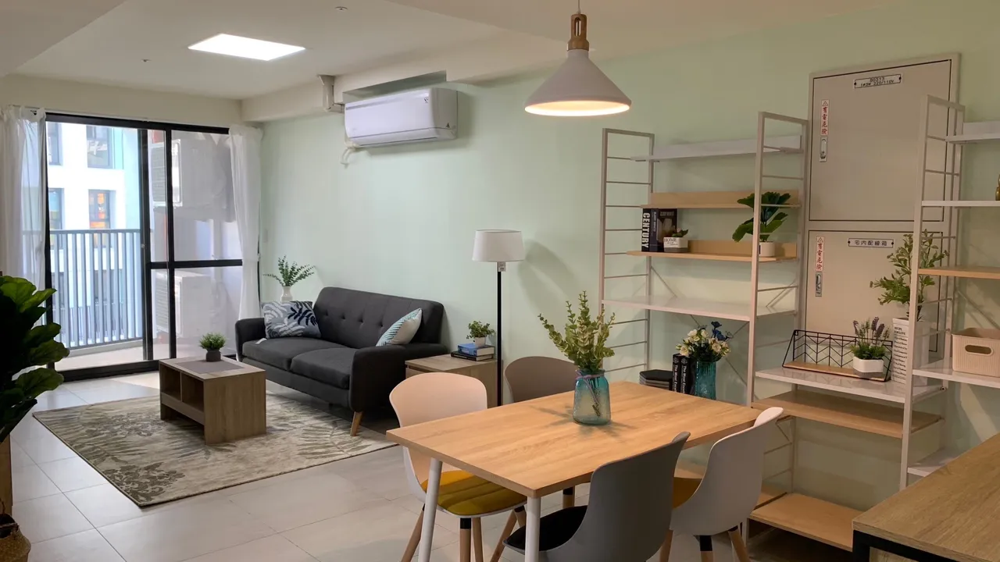

講了N年的居住正義，終於在高雄繳出樂第一份成績單。位在高雄市苓雅區，全新社會宅月租只要:moneybag:3900元起:moneybag:，今天來好好介紹一下。自己看完都很想去租，可惜工作不在高雄:cry:。

## 高雄全新社會宅月租:moneybag:3900元起:moneybag:符合這些條件可申請！
參考資料：
- [https://tw.nextapple.com/life/20230201/FC22E601E9D421D9056765B0F613AFFD](https://tw.nextapple.com/life/20230201/FC22E601E9D421D9056765B0F613AFFD)
- [高雄市都發局新聞稿](https://urban-web.kcg.gov.tw/KDA/web_page/KDA020100.jsp?PK01=KDA070000001202301027&PK02=KDA020102.jsp)

「凱旋青樹」，位於苓雅區，北臨鐵路地下化綠園道、南臨凱旋一路，距離台鐵民族站僅300公尺，交通與生活機能十分便利。規劃1~3房，從最小9坪的單身套房，到適合家庭使用的37坪格局。一房型127戶、二房型99戶、三房型19戶，共245戶住宅單元，每戶配有冷氣、電熱水器，並設有托嬰中心及店舖等社福與商業設施，可提供社宅住戶及周邊社區居民完善的生活及購物需求。

2/1～2/5開放參觀，2/7～3/1開放申請。參觀首日即湧入超過500組([https://udn.com/news/story/7327/6942098](https://udn.com/news/story/7327/6942098))
")

申請條件需具六要件，分別為年滿18歲、設籍高雄、於高雄就學或就業，月入低於最低生活費3.5倍（2023年度為5萬467元）、申請者本人與配偶與同戶籍子女在高雄都無房屋，都沒領取住宅津貼者。
")

光是看到第一天的參觀組數即較總戶數還多，便可以知道居住在台灣仍然是最大的問題之一。希望有一天，居住不再是大家最擔心的議題，居住正義這四個字被全社會給遺忘，人人都能擁有屬於自己的空間。

## 2022年買賣移轉棟數年減8.7%，量縮！價跌？
大家都知道，價錢要跌的先決條件是量要減少。2022年全國移轉31萬餘棟，較2021年下降8.7%。然而32萬棟在曆上上仍處於偏高的狀況。在2022年後半房市急凍的狀態下，移轉棟數會持續緩步下移至1-2年後才會有顯著下降（預售屋交屋才算移轉）。

搭配1月通過的平均地權條例對於市場預售屋的打擊，至少建設公司們非常看淡未來半年的市況。還沒看的可以參考我之前的文章（[平均地權條例通過了！小資族買房有望了嗎？｜小鶴不動產週報](https://tsurumoto-shi.github.io/home/posts/20230114/)）。

因此現在的房市呈現拉鋸，賣方仍然堅守價格，而買方持續呈現觀望。依照今年預估仍有30萬棟移轉的條件下，今年大疊的機會幾乎沒有。應該是持平後緩步下跌的走勢。但是現在開始看房刀子可以大隻一點喔，或許有機會挑到實惠的標的。

實際的數字可以參考[買房網實價登錄](https://price.housefun.com.tw/%E8%A1%8C%E6%83%85%E8%B3%87%E8%A8%8A/%E5%8F%B0%E5%8C%97%E5%B8%82)，他們有做各區的實價登錄比較，還滿方便的喔。:wink::wink:

---
如果喜歡相關的內容，麻煩幫我追蹤Dcard、youtube。或者按下右下角的按鈕幫我買杯咖啡喔。:baby_chick::baby_chick::baby_chick:
