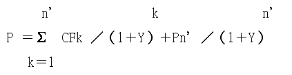

此筆記為快速複習用筆記，用以紀錄複習過程。幫助備考，也希望能夠幫助有需要的其他人。

## 重要名詞

#### 價格種類
- 正常價格
  - 標售`不屬於`正常價格
- 限定價格
- 特定價格
- 特殊價格

#### 租金
- 正常租金
- 限定租金

#### 日期
- 價格日期
- 勘查日期

#### 標的
- 勘估標的
- 比較標的
  - 同一供需圈
  - 近鄰地區
  - 類似地區
#### 因素
- 一般因素
- 區域因素
- 個別因素
  1. 宗地條件：宗地面積、深度、寬度、形狀、位置、地勢、毗鄰狀況、開發規模等。

  2. 街道條件：包括鄰接街道寬度、交通、結構等。

  3. 交通條件：包括附近交通站牌多寡、離車站、市場、商店、公共設施之遠近等。

  4. 環境條件：包括自然環境、社會環境、公共設施數量等。

  5. 行政條件：如使用分區管制、土地容許使用項目、開發限制、土地使用年限、建蔽率、容積率等

#### 情況調整
比較標的之價格形成條件中有非屬於一般正常情形而影響價格時，或有其他足以改變比較標的價格之情況存在時，就該影響部分所作之調整。

#### 估價原則
- 預測原則 : 未來景氣 & 潛力
- 變動原則 : 價格變動須依據價格日期
- 供需原則
- 競爭原則
- 替代原則
- 機會成本
- 均衡原則 : 是否內部構成要素之組合是否達到均衡，判定不動產是否發揮`最有效使用`
- 貢獻原則
- 收益分配原則 : 不動產收益 - 已支出成本 = 不動產純益
- 適合原則 : 是否外部構成要素之組合是否達到均衡，判定不動產是否發揮`最有效使用`
- 外部性原則
- 最有效使用原則
- 收益遞增遞減原則
- 合法原則

## 比較法
比較法是基於`替代原則`，採用3件以上比較標的。

#### 調整項目
1. 情況調整 : 非屬一般情形而影響價格時
2. 價格調整 : 價格日期調整
3. 區域因素調整 : 不在同一近鄰地區
4. 個別因素

#### 勘估標的價格
勘估標的價格 = 比較標的價格 * 情況調整 * 價格調整 * 區域因素調整 * 個別因素

#### 比較法調整項目調整方法
1. 百分率
2. 差額
3. 計量模型分析法
- 自變數5倍以上的標的
- 判定係數不得低於0.7
- 截距項必須 <= 0.05

#### 比較法估價程序
1. 蒐集並查證比較標的相關資料。
2. 選擇與勘估標的條件相同或相似之比較標的。
3. 對比較標的價格進行情況調整及價格日期調整。
4. 比較、分析勘估標的及比較標的間之區域因素及個別因素之差異，並求取其調整率或調整額。
5. 計算勘估標的之試算價格。
6. 決定勘估標的之比較價格。

#### 比較法排除適用
- 調整限制
  1. 任一調整項目 > 15%
  2. 總調整項目 > 30%
- 試算價格標的

經比較調整後求得之勘估標的試算價格，應就價格偏高或偏低者重新檢討，經檢討確認適當合理者，始得作為決定比較價格之基礎。檢討後試算價格之間差距仍達`百分之二十以上`者，應排除該試算價格之適用。

(高價 - 低價) / [(高價 - 低價) / 2] >= 20% 排除適用

## 收益法
客觀淨收益應以契約租金計算

#### 收益法估價程序
1. 蒐集總收入、總費用及收益資本化率或折現率等資料 (最近3年間)
2. 推算有效總收入
3. 推算總費用
4. 計算淨收益
5. 決定收益資本化率或折現率
6. 計算收益價格

#### 收益資本化率
1. 風險溢酬法
2. 市場萃取法
3. 加權平均資金成本法
4. 債務保障比率法

收益資本化率 = 債務保障比率(DCR)  X  貸款常數(MC)  X  貸款成數(LR)
- 債務保障比率 = 營運淨收益 / 每年應償還本利和
- 貸款常數(MC) =  { [ 年利率 * (1+年利率) ^年數 ]  } / { [ (1+年利率) ^年數] - 1 }
5. 有效總收入乘數法

收益資本化率 = 淨收益率 / 有效總收益乘數

#### 計算收益價格
1. 土地收益價格
  - 無建物 : 土地收益價格 = 土地淨收益 / 土地收益資本化率
  - 有建物 : (房地淨收益 - 建物淨收益) / 土地收益資本化率
2. 建物收益價格
土地淨收益可以`比較法`取得`土地比較價格`
  - 已扣除折舊提存費
    - 建物收益價格 = 建物淨收益 / 建物收益資本化率
    - 建物收益價格 = (房地淨收益 - 土地淨收益) / 建物收益資本化率

  - 未扣除折舊提存費
    - 建物收益價格 = 建物折舊前淨收益 / (建物收益資本化率+建物價格日期當時價值未來每年折舊提存率)
    - 建物收益價格 = (房地淨收益 - 土地淨收益) / (建物收益資本化率+建物價格日期當時價值未來每年折舊提存率)
3. 房地收益價格
  - 房地收益價格 = 房地淨收益 / 房地綜合收益資本化率
  - [已扣除折舊提存費] 房地綜合收益資本化率 = 土地收益資本化率 * 土地價值比率 + 建物收益資本化率 * 建物價值比率
  - [未扣除折舊提存費] 房地綜合收益資本化率 = 土地收益資本化率 * 土地價值比率 + 建物收益資本化率 + (建物價隔日奇美年折舊提存率) * 建物價值比率

#### 一定期間收益價格
P = a * [1 - (1 / (1+r)^n')] / r

P = 收益價格
a = 平均一年折舊前淨收益
r = 收益資本化率
n' = 可收益年數

#### 收益估價
1. 直接資本化法

收益價格(P) = 未來一年淨收益(a) / 收益資本化率

2. 折現現金流量分析法

- P ：收益價格。
- CFk ：各期淨收益。
- Y ：折現率。
- n’ ：折現現金流量分析期間。
- k ：各年期。
- Pn’：期末價值。

#### 折舊提存費
C = 建物總成本
s = 殘餘價格率 (不超過10%為原則)
i = 自有資金之利率
N = 經濟耐用年數
1. 等速折舊型: C(1-s) / N
2. 償債基金型: C(1-s)*i / [(1+i)^N - 1]

#### 折舊提存率
d = 建物價格日期當時價值未來每年折舊提存率
(1-s) / N = 折舊率
n = 已經歷年數
n' = 剩餘可收益年數
i = 自有資金之利率
1. 等速折舊型: d = [(1-s) / N] / [1-(1-s)*n/N]
2. 償債基金型: d = i / [(1+i)^n'-1]

#### 計算收益價格
1. 地上無建物

P = 土地淨收益 / 土地收益資本化率
2. 地上有建物

P = (房地淨收益 - 建物淨收益) / 土地收益資本化率

## 成本法
1. 蒐集資料。
2. 現況勘察。
3. 調查、整理、比較及分析各項成本及相關費用等資料。
4. 選擇適當方法推算營造或施工費。
5. 推算其他各項費用及利潤。
6. 計算總成本。
7. 計算建物累積折舊額。
8. 計算成本價格。

#### 土地開發分析法
- 估價程序
  1. 確定土地開發內容&預期開發時間
  2. 調查各項成本及相關費用並蒐集市場行情資料
  3. 現況勘查並進行環境發展程度調查&分析
  4. 估算開發或建築後可銷售之土地或建物面積
  5. 估算開發或建築後總銷售金額
    - 以比較法or收益法求之
  6. 估算各項成本及相關方案
    - 相關費用以不動產估價公會全國聯合會公告
    - 廣告費按`總成本`or`總銷`3-7%
    - 管理費按`總成本`or`總銷`1.5-3%，依公寓大廈管理條例規定設有公共基金者可提高至4-5%
    - 稅捐按`總成本`or`總銷`0.5-1.2%
    - 土地開發設計費按工程造價計算表or實際營造施工費2-3%
  7. 選擇適當之利潤&資本利息綜合利率
    - 不得高於定存年利率
    - 不得低於活存年利率
    - 資本利息綜合利率 = 資本利息年利率 * (土地價值比率+建物價值比率/2) * 開發年數
  8. 計算土地開發分析價格
    - V = S / (1+R) / (1+i) -(C+M)
    V = 土地開發分析價格
    S = 總銷
    R = 利潤率
    C = 直接成本
    D = 間接成本
    i = 資本利息綜合利率

#### 成本法折舊
1. **等速折舊**

Dn = C * [(1 - s) / N] * n

- Dn = 累計折舊額
- C = 建物總成本
- s = 殘餘價格率
- N = 耐用年數
- n = 已經歷年數

2. **初期加速折舊**

Dn = C * [1 - (1 - d)^n]

- Dn = 累計折舊額
- C = 建物總成本
- d = 定律法折舊率
- n = 已經歷年數

3. **初期減速折舊**

Dn = C * (1 - s) * i * [(1 + i)^n -1] / [(1+i)^N - 1] / i

- Dn = 累計折舊額
- C = 建物總成本
- s = 殘餘價格率
- N = 耐用年數
- n = 已經歷年數
- i = 利率

#### 估價原則
- 公共設施用地及公共設施保留地之估價，以`比較法`估價為原則

## 房地估價
#### 層別效用比
- 以最便宜之一層的單價為基礎（即設為100%）來計算其他各層樓之比率

#### 建物地價分配率
建物地價分配率 = 樓層別效用比 - (平均樓層效用比 * 全棟建物成本佔房地成本比例)

#### 宗地估價
1. 以合併或分割為前提之宗地估價
- 以合併或分割為前提之宗地估價，應考慮合併或分割前後之價格變動情形，而予酌量增減。(估83)

2. 數筆合一之宗地估價(估84)
- 數筆土地合併為一宗進行土地利用之估價，應以合併後土地估價，並以合併前各筆土地價值比例分算其土地價格。

- 非以合併一宗進行土地利用為目的之數筆相連土地，其屬同一土地所有權人所有者，比照前項規定計算。

3. 不同法定用途之宗地估價
- 一宗土地內有數種不同法定用途時，應考量其最有效使用及各種用途之相關性及分割之難易度後，決定分別估價或依主要用途估價。(估85)

4. 部分估價
- 附有建物之宗地估價，應考慮該建物對該宗地價格造成之影響。但以素地估價為前提並於估價報告書敘明者，不在此限。(估86)

5. 即將開發之宗地
以土地開發分析法估價後參考比較法or收益法

6. 設施通過之宗地
先估算正常價格再增減

7. 溫泉
溫泉地之估價，應考慮溫泉地之水權內容、開發成本、水量、水質、水溫、當地之交通情形、相關設施及遊客人數等影響溫泉地價格之因素。

8. 高爾夫球場
高爾夫球場之估價，應考慮會員制度、球場設施、開發成本、收益及營運費用等因素。

9. 林地
林地之估價，得視林木之成長情形而分別採取`比較法`、`收益法`及`成本法`估計之。於採成本法估價時，其總費用之計算，應考量造林費、林地改良費及道路開挖費用。

10. 農場&牧場
農場或牧場之估價，以`比較法`估價為原則。無買賣實例者，得以附近土地價格為基礎，考慮其位置、形狀、地形、土壤特性及利用狀況等差異，比較推估之。

11. 鹽田
鹽田之估價，以`比較法`估價為原則。無買賣實例者，得以附近土地價格為基礎，考慮其日照、通風、位置及形狀等差異，比較推估之。

12. 池沼&墓地
池沼、墓地之估價，以`比較法`估價為原則。無買賣實例者，得以附近土地價格為基礎，考慮位置、形狀、利用狀況等差異，比較推估之。

13. 公共設施地&保留地
公共設施用地及公共設施保留地之估價，以`比較法`估價為原則。無買賣實例者，得比較其與毗鄰土地使用分區及使用強度差異，及土地價值減損情況，並斟酌毗鄰土地平均價格為基礎推算之。

14. 重點建築改良物
`成本法`

15. 附著土地之工事
`成本法`

16. 農作改良物
 - 農作改良物幼小且距孳息成熟期尚長者，依其種植及培育費用，並視作物生長情況估計之。
 - 農作改良物接近孳息成熟期者，應估計其收穫量及市場價格，必要時得扣減價格日期至作物孳息成熟期間收成所應投入之費用。
 - 農作改良物距成熟期一年以上，且有期待收穫價值者，得以產地價格為基礎，推估未來收穫價格後，折算為價格日期之價格。但應扣除價格日期至作物孳息成熟期間收成所應投入之費用。

17. 水利土壤改良
`成本法`

## 其他
- 已開闢道路及其二側或一側帶狀土地，可就具有顯著商業活動之繁榮地區，依當地發展及地價高低情形而劃設為`繁榮街道路線價區段`與`一般路線價區段`

- 地上權
P = a * [(1 + r)^n - 1] / r * (1 + r)^n

---
如果喜歡相關的內容，麻煩幫我追蹤Dcard、youtube。或者按下右下角的按鈕幫我買杯咖啡喔。:baby_chick::baby_chick::baby_chick:
